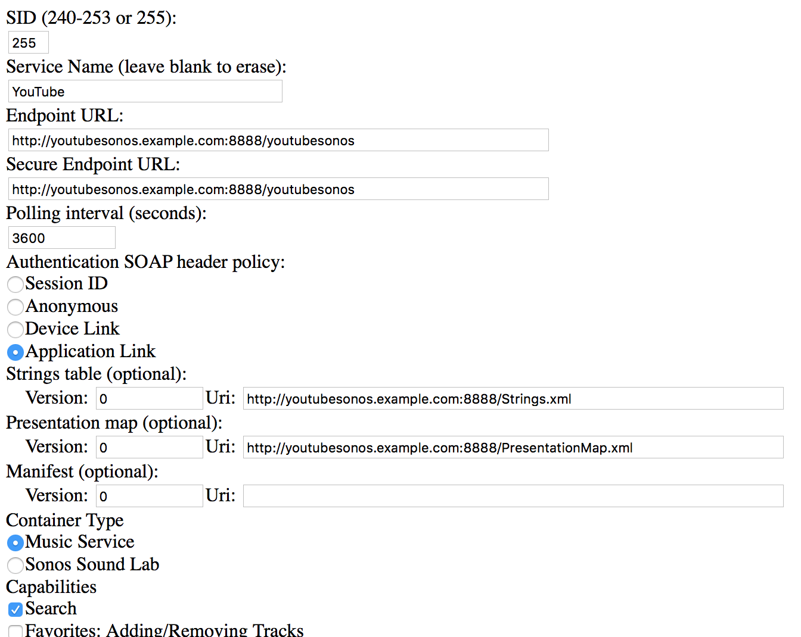

YouTubeSonos
============

A Sonos Music API (SMAPI) implementation to enable YouTube on Sonos

Current features include:

* Browsing popular music
* Browsing user playlists
* Browsing user subscriptions (videos and playlists)
* Searching for channels, playlists and videos
* Playing sound from a video

## How it works

YouTubeSonos uses the YouTube Data API v3 to retrieve content from YouTube which uses OAuth2 to authenticate a user. In order for Sonos to display data from YouTube, the SMAPI implementation is used to act as a layer between YouTube and Sonos.

To actually play the sound from a YouTube video, `youtube-dl` is used to download the audio. This audio is then passed on through `ffmpeg` to covert Dash audio to mp3, because Sonos players cannot playback Dash audio.

This is made available to the Sonos system by an http web server that is created when YouTubeSonos is started. The web server hosts the SMAPI implementation, an OAuth2 callback page for YouTube user authentication and a page that delivers the mp3 audio to a Sonos player.

## How to run

YouTubeSonos currently only works on MacOS and Linux. This is because it uses `/bin/sh` with `youtube-dl` and `ffmpeg`. Use one of the following command to install these on your machine.

On MacOS using homebrew
```
brew install youtube-dl ffmpeg
```

On Linux using apt
```
apt-get install youtube-dl ffmpeg
```

Next, you will need to obtain a YouTube Data API key. To do so, follow the first three steps as described [here](https://developers.google.com/youtube/v3/getting-started). Download the JSON file and put it in `src/main/resources` named `client_secret.json`

Then you should configure the various settings in `src/main/resources/Settings.properties`:

* **web_server_host**: the host on which the web server will be available.

* **web_server_port**: the port on which the web server will be available.

* **web_server_url**: the URL on which the web server will be accessible. An actual domain name is required, because Google doesn't allow an IP address to be used as a redirect URL for OAuth2 authentication. Make sure that this domain name points to your IP address.

* **smapi_path**: the path on which the SMAPI will be available.

* **auth_path**: the path on which the YouTube OAuth callbacks will be received. This and `web_server_url` are used as redirect URL after the user completes OAuth2 authentication. Make sure that this URL is listed as redirect URL in your project. Otherwise Google will return an error upon opening the authentication page.

* **media_path**: This path will be used to store mp3 files of already played YouTube videos. When the audio of a YouTube video is requested by a Sonos player, YouTubeSonos will check wether or not the audio for this video is already present in this folder and use that one. If not, the audio will be downloaded and stored in this folder.

Default values for these settings are provided in this file already to get you started.

Next, you should be able to run YouTubeSonos by using `./gradlew run` or you can create a distribution zip by using `./gradlew distZip`.

## How to add to Sonos
To add this service to Sonos you should obtain an IP address from one of your Sonos speakers. To do so open your Sonos app, hit settings and check out info about your Sonos system. Use one of the IP addresses listed, open your browser and navigate to `http://<ipofyoursonosspeaker>:1400/customsd.htm`.

Fill in the fields as follows:

* **SID**: 255

* **Service Name**: YouTube

* **Endpoint URL**: the values provided for `web_server_url` and `smapi_path`. Or you can use the values provided for `web_server_host`, `web_server_port` and `smapi_path`. Note that if you are using 0.0.0.0 you should use an actual IP address on which the machine running YouTubeSonos is available. (hint: use ifconfig/ipconfig)

* **Secure Endpoint URL**: same as Endpoint URL

* **Polling interval (seconds)**: 3600

* **Authentication SOAP header policy**: Application Link

* **Strings table (optional)**: `web_server_url`/Strings.xml

* **Presentation map (optional)**: `web_server_url`/PresentationMap.xml

* **Container Type**: Music Service

* **Capabilities**: Search

And hit send.

You should now be able to add YouTube just as any other normal Sonos music service by using your Sonos controller app.

## Example configuration

Using the following Settings.properties:

```
web_server_host=0.0.0.0
web_server_port=8888
web_server_url=http://youtubesonos.example.com:8888

smapi_path=/youtubesonos
auth_path=/oauth2callback

media_path=media
```

This would be how to add the service to Sonos:


